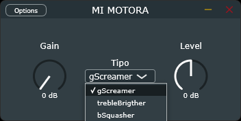

# MI MOTORA

esto es efecto de audio hecho en C++ utilizando el framework juce.
hago esto en mis tiempos libres pa aprender c y al arte del...

***digital signal processing***.

## esto pa k es

bueno, el proposito de este efecto de audio es distorsionar guitarras electricas (o lo k quieras en realidad). 
de momento tiene 3 tipos de distorsión:

  - SoftClip (gScreamer).
  - SoftClip con boost de agudos (trebleBrigther).
  - HardClip pero límpio y no muy hard (bSquasher).

aqui hay una prueba de sonido del modo gScreamer. 
*(acuerdate de activar el sonido)*
**(LEER ABAJO)**

https://github.com/user-attachments/assets/42701dfd-34c0-4c4c-8fd9-a63af31835f8
#### (EL VIDEO ES DE UNA VERSIÓN MUY ANTERIOR, EL SONIDO PUEDE HABER CAMBIADO LIGERAMENTE)

## Installation
te bajas el vst3, lo pones en tu carpeta de vst3's y recargas.

## Usage
vas moviendo los botoncitos hasta que suene como te gusta.

si no te agrada ningún sonido despues de mover los botoncitos, cambia de modo y repite el primer paso.

## Known Issues

- si te pones a jugar un poco con el volumen de salida es probable que dejes de recibir señal, especialmente si tienes la distorsión muy subida. Es más, es probable que daw te indique que la señal es muy alta pero no suene nada.
- ligeros pops y clicks cuando subes el gain (aunque creo que es normal).
- la interfaz es fea como sus muertos.

de todas formas, **claramente este plugin no está destinado a ser usado en un entorno de producción real**. vaya, que no me hago cargo de ningún mal funcionamiento ni perjuicio de nada, *hubieras estudiado*.

## Acknowledgements
he usado este repo como plantilla:
https://github.com/joonastuo/Distortion

he cambiado bastantes cosas, pero todas las interfaces y clases me han enseñado mucho de como funciona juce.
un grande el joonastuo ese.

## ====================

A ella le gusta mi motora, montarse en mi motora
A ella le gusta mi motora, montarse en mi motora
A ella le gusta mi motora, montarse en mi motora
A ella le gusta mi motora, montarse en mi motora

Súper cómodo el sillín, si te sientas, no te vas a querer ir
¿Qué importa que mi motora sea del 2000?
Vas a gozar más que con cualquier otra motora
La mía es especial, es mejor que la batidora
Brinca y salta, como si fuera un trampolín
Y son nuevas las suspensiones, no se van a partir
Te lo advertí, si te montas no te va' querer ir
Jovani, el que la pone a bailar a las meri'
Esta temblando la pista, mi motora está lista
Pa' salir chillando con [?], quédanse con la otra pista (Wututun, wututun)
La compa' necesita lo que tiene este artista
Que sigan intentando si llegan desde chiripa

